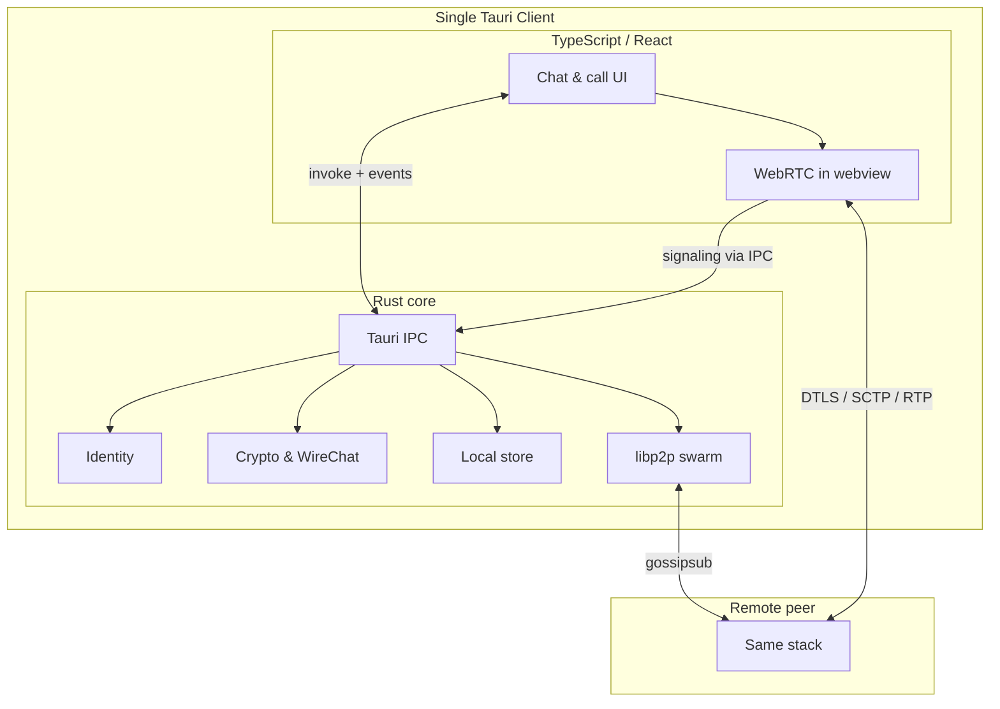
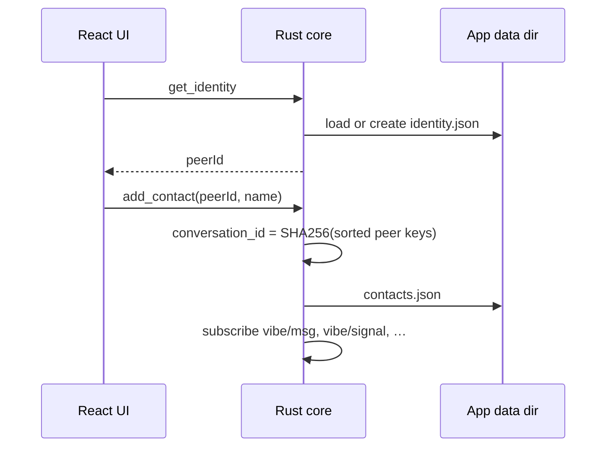
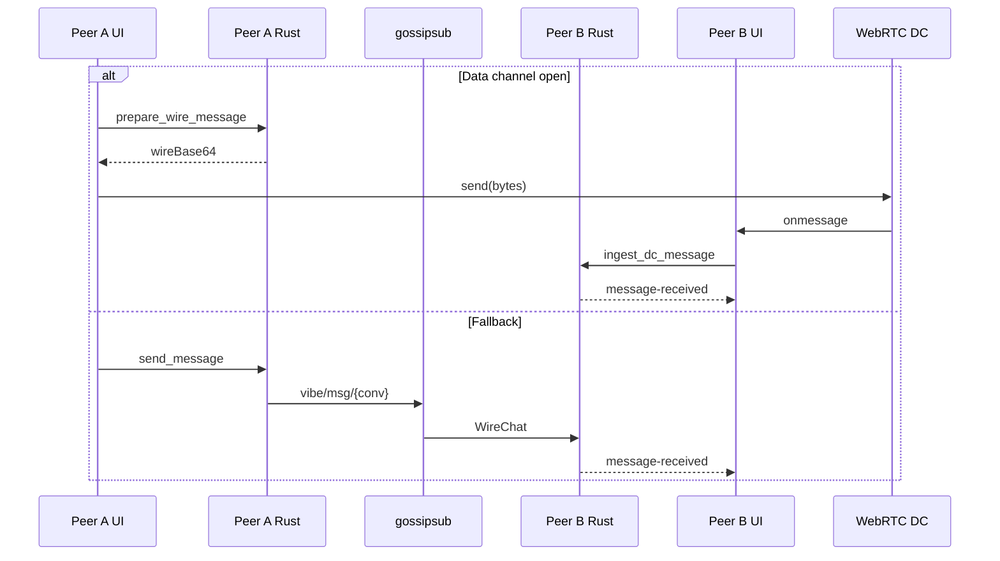

# Architecture

How **Vibe** works as a platform and how the reference client splits work between **Rust** (Tauri core) and **TypeScript** (React UI). For protocol rules and security requirements, see [SPEC.md](./SPEC.md). For term definitions, see [GLOSSARY.md](./GLOSSARY.md).

---

## Platform overview

Vibe is a peer-to-peer communications client with **no central servers** operated by the project. Two users who know each other's **Peer ID** (or meet via a shared **room code**) can:

1. **Discover** each other on a libp2p overlay (LAN mDNS today; DHT on the roadmap).
2. **Exchange encrypted signaling** over gossipsub so WebRTC can connect.
3. **Chat** over a WebRTC data channel when possible, with gossipsub as fallback.
4. **Call** (voice/video) over separate WebRTC peer connections using the same encrypted signaling path.

There is no Vibe-hosted broker for messages, calls, or identity. Private keys and session crypto live in Rust; the webview renders UI and drives WebRTC APIs exposed by the platform.



---

## Three data planes

The spec describes three logical planes. The reference client implements the first two today; IPFS persistence is planned.

| Plane | Purpose | Implemented by |
| ----- | ------- | -------------- |
| **Realtime** | Live text, voice, video while peers are online | WebRTC in the webview (`src/lib/webrtc.ts`, `src/lib/calls.ts`) |
| **Overlay** | Discovery, encrypted signaling, message relay, acks/reads | libp2p gossipsub in Rust (`src-tauri/src/network.rs`) |
| **Persistence** | Profiles, attachments, optional history (content-addressed) | Planned via IPFS; local JSON/SQLite-style files for contacts and messages today |

---

## Rust ↔ TypeScript split

Tauri embeds a system webview that runs the Vite-built React app. Rust and TypeScript communicate through **Tauri IPC**:

- **Commands** (`invoke`) — UI requests an action; Rust performs it and returns a typed result.
- **Events** (`listen`) — Rust pushes updates to the UI (new message, signaling payload, room peer, etc.).

### Trust boundary

| Responsibility | Layer | Rationale |
| -------------- | ----- | --------- |
| Ed25519 identity, private key storage | **Rust** | Keys never enter the webview |
| ChaCha20-Poly1305 encrypt/decrypt, `WireChat` build/ingest | **Rust** | Consistent crypto; no secret material in JS |
| libp2p swarm, topic subscribe/publish | **Rust** | Long-lived network I/O on a Tokio runtime |
| Contacts, message history, outbox | **Rust** | Durable local state under app data dir |
| `RTCPeerConnection`, media capture, data channels | **TypeScript** | WebRTC is a browser/webview API |
| SDP/ICE handling, offer/answer state machine | **TypeScript** | Same; signaling *bytes* are encrypted by Rust before publish |
| Presentation, routing, call UX | **TypeScript** | React components and hooks |

The UI **must not** implement protocol cryptography or hold long-lived secrets. It passes plaintext message bodies to Rust for encryption and receives decrypted rows back via events.

---

## Repository layout

```
vibe/
├── src/                    # React UI, hooks, WebRTC logic
│   ├── routes/             # TanStack Router pages
│   ├── components/         # Chat, call, shadcn/ui
│   ├── hooks/              # useConversations, useCall, …
│   ├── lib/
│   │   ├── tauri.ts        # Typed IPC wrapper (invoke + listen)
│   │   ├── webrtc.ts       # Peer connections, text DC, signaling
│   │   └── calls.ts        # Voice/video call state machine
│   └── contexts/           # ConversationsProvider, CallProvider
│
└── src-tauri/src/          # Rust application core
    ├── lib.rs              # AppState, Tauri commands, wiring
    ├── identity.rs         # Ed25519 keypair, backup import/export
    ├── crypto.rs           # WireChat, signaling crypto, room hashes
    ├── network.rs          # libp2p swarm, gossipsub, mDNS
    ├── store.rs            # contacts.json, per-peer message files
    └── outbox.rs           # Pending message flush over gossipsub
```

---

## Rust core

### `AppState`

Central state created at startup (`lib.rs`):

- **`data_dir`** — OS app data directory (identity, contacts, messages).
- **`identity`** — Ed25519 / libp2p keypair (`identity.json`).
- **`store`** — `EphemeralStore`: contacts and message history on disk.
- **`network`** — `NetworkHandle`: async libp2p task and command channel.
- **`app`** — `AppHandle` for emitting events to the webview.

### Identity (`identity.rs`)

- One Ed25519 keypair per installation; **Peer ID** = public key (base64url).
- Persisted as `identity.json` (`vibe-identity/1` backup format).
- Import/export/regenerate clears local contacts and restarts the network.

### Crypto (`crypto.rs`)

- **`WireChat`** — JSON envelope with ciphertext for chat (gossipsub or data channel).
- **`SignalWire`** — Outer gossip envelope `{ senderPeerId, payload }` so the swarm can filter self-echoes before the UI sees signaling.
- **Session keys** — Per-contact symmetric keys derived and stored in the ephemeral store (Noise-style agreement path per spec; reference uses stored session material for 1:1).
- **Helpers** — `conversation_id`, `room_topic_hash`, ack/read wire formats, `ingest_wire_chat` → emits `message-received`.

### Network (`network.rs`)

Runs a libp2p **Swarm** on a dedicated Tokio task with:

- **TCP** + **Noise** + **Yamux**
- **gossipsub** — pub/sub for messages, signaling, room presence
- **mDNS** — LAN peer discovery
- **identify** — protocol version (`vibe/0.1.0`)
- **request-response** — room announce over `/vibe/room-announce/1`

**Gossipsub topics** (per conversation or room):

| Topic pattern | Direction | Content |
| ------------- | --------- | ------- |
| `vibe/msg/{conversation_id}` | Chat relay | Encrypted `WireChat` bytes |
| `vibe/signal/{conversation_id}` | WebRTC signaling | Encrypted SDP/ICE/call JSON (inner payload) |
| `vibe/ack/{conversation_id}` | Delivery | Encrypted delivery ack |
| `vibe/read/{conversation_id}` | Read receipts | Encrypted read ack |
| `vibe/room/{hash}` | Discovery | Signed room announces |
| `vibe/room/{hash}/presence` | Discovery | Join/leave events |

Incoming gossipsub messages are decrypted/verified in Rust. Signaling payloads are emitted to the UI as `signaling` events; chat messages update the store and emit `message-received`.

### Store (`store.rs`)

Local persistence (not IPFS):

- `contacts.json` — peer ID, display name, conversation ID, preview, unread count.
- `messages/{peerId}.json` — ordered message rows (text and call history metadata).
- Outgoing messages may be **`pending`** until gossipsub publish succeeds; `outbox.rs` retries when peers appear.

---

## TypeScript frontend

### IPC layer (`lib/tauri.ts`)

Thin typed wrappers around every `#[tauri::command]` and event listener. This is the only module that should call `@tauri-apps/api` directly for app logic.

### Conversations (`hooks/use-conversations.ts`)

- Loads contacts and starts the overlay on mount.
- Subscribes to `message-received`, `message-ack`, `message-read`, `conversation-read`, `message-updated`, `outbox-flushed`.
- **`sendMessage`** delegates to `sendTextMessage` in `webrtc.ts` (hybrid transport).

### WebRTC (`lib/webrtc.ts`)

Owns in-memory maps of **`RTCPeerConnection`** per remote peer:

- **Text PC** — one connection per contact; data channel label `vibe/text`.
- **Call PC** — separate connection for voice/video so call renegotiation does not block text.

**Polite / impolite** negotiation: the peer with the lexicographically **higher** Peer ID is the offerer; the lower peer answers. This avoids offer glare when both sides connect at once.

**Signaling path:**

1. TS builds SDP/ICE JSON.
2. `encryptSignaling(peerId, json)` → Rust encrypts for the contact.
3. `publishSignaling(conversationId, ciphertext)` → Rust wraps in `SignalWire` and publishes on `vibe/signal/...`.
4. Remote Rust receives gossipsub → emits `signaling` event.
5. TS calls `decryptSignaling` → applies offer/answer/ICE to the PC.

**Text send path (`sendTextMessage`):**

1. If data channel is **open** → Rust `prepareWireMessage` (encrypt + persist) → TS sends raw bytes on DC → `markOutgoingSent`. UI shows **Direct**.
2. Else → Rust `send_message` publishes on gossipsub; UI shows **Network**. TS still tries `ensureTextTransport` in the background to upgrade the path.

### Calls (`lib/calls.ts`, `hooks/use-call.ts`)

- Call signaling types: `call-invite`, `call-answer`, `call-decline`, `call-end` (with `callLeg` for glare handling).
- Uses **`ensureCallPeerConnection`** (dedicated PC), `getUserMedia` for local A/V, `ontrack` for remote streams.
- **`recordCallHistory`** persists call rows via Rust and emits them like messages.
- UI: `CallShell`, `CallOverlay`, `IncomingCallDialog` mounted from `AppProviders`.

### UI composition

```
__root.tsx
  └── AppProviders
        ├── ConversationsProvider  → useConversations
        ├── CallProvider           → useCall
        ├── ChatLayout             → list + thread + discovery dialogs
        └── CallShell              → overlay + incoming dialog
```

Routes under `src/routes/` provide the tab shell (text chat is primary; voice/video tabs are placeholders for call history).

---

## IPC reference

### Commands (UI → Rust)

| Command | Role |
| ------- | ---- |
| `get_identity`, `export_identity_backup`, `import_identity_backup`, … | Identity lifecycle |
| `add_contact`, `list_contacts`, `remove_contact` | Address book |
| `join_room`, `leave_room`, `list_room_peers`, `room_status` | Room-scoped discovery |
| `start_network`, `subscribe_conversation`, `overlay_peer_count` | Overlay control |
| `send_message`, `flush_outbox`, `prepare_wire_message`, `persist_outgoing_message` | Outbound chat |
| `encrypt_signaling`, `decrypt_signaling`, `publish_signaling` | WebRTC signaling over gossipsub |
| `ingest_dc_message` | Inbound chat from data channel |
| `list_messages`, `mark_conversation_read`, `record_call_history` | History and receipts |

### Events (Rust → UI)

| Event | When |
| ----- | ---- |
| `message-received` | New inbound chat or call history row |
| `message-ack` / `message-read` | Delivery or read receipt from peer |
| `message-updated` | Outgoing message left pending state |
| `conversation-read` | Local mark-read completed |
| `signaling` | Encrypted signaling payload for a conversation |
| `room-peer` / `room-event` | Room discovery updates |
| `overlay-peers-changed` | Connected libp2p peer count changed |
| `identity-changed` | Identity import/regenerate |
| `outbox-flushed` | Pending messages retried |

---

## End-to-end flows

### 1. First launch and contacts



Contacts are intentional: room discovery alone does not authorize messaging (spec §5.5).

### 2. Room discovery (LAN)

1. User joins room with a code → Rust derives `vibe/room/{hash}` and subscribes.
2. Client publishes signed **announce** messages on an interval with listen addresses.
3. mDNS and gossipsub propagate announces; Rust emits `room-peer` to the UI.
4. User adds a discovered peer as a contact to start a 1:1 conversation.

### 3. Text message (hybrid transport)



Parallel path: both sides run **`ensureTextTransport`** so SDP/ICE over encrypted signaling can open the `vibe/text` channel for later messages.

### 4. Voice or video call

1. Caller obtains local `MediaStream`, creates **call** `RTCPeerConnection`, adds tracks.
2. Caller sends `call-invite` (SDP + media kind) through encrypt → publish signaling.
3. Callee shows incoming dialog; on accept, sets remote description, creates answer, publishes `call-answer`.
4. ICE trickle continues on the same signaling topic until media flows (`ontrack`).
5. Hang up publishes `call-end`; PCs closed; optional `record_call_history` in Rust.

Text and call can use **different** peer connections so a call reoffer does not tear down the text data channel.

---

## Local data on disk

Under the Tauri app data directory (platform-specific):

| File / dir | Contents |
| ---------- | -------- |
| `identity.json` | Ed25519 public/private key (sensitive) |
| `contacts.json` | Contact list and previews |
| `messages/*.json` | Per-peer message history |

Session keys and crypto state live in the store's in-memory/disk structures managed alongside messages. This is **device-local** chat history, not IPFS-backed history (planned M3).

---

## Build and runtime

| Piece | Technology |
| ----- | ---------- |
| Native shell | Tauri v2 (Rust) |
| Async runtime | Tokio (network task) |
| UI | React 19 + Vite |
| Routing | TanStack Router |
| Styling | Tailwind CSS 4 + shadcn/ui |
| Package manager | Bun |

Development: `bun run tauri dev` starts Vite and the native app; mobile builds use the same Rust core with platform webviews (WKWebView, Android WebView).

---

## Current limits and roadmap

| Area | Today | Spec / roadmap |
| ---- | ----- | -------------- |
| Message transport | WebRTC DC + gossipsub fallback | CBOR length-prefixed frames |
| Discovery | mDNS + room codes | Kademlia DHT, rendezvous |
| NAT traversal | STUN in webview ICE config; empty by default in strict spec | User-configured STUN/TURN (Pragmatic profile) |
| Persistence | Local JSON files | IPFS profiles, attachments, optional encrypted history |
| Group chat | Not implemented | Sender Keys, group manifest (M2) |
| Full Noise handshake | Session keys in store | `/vibe/noise/1` stream before signaling (§9.3) |

See [README.md](./README.md) for milestone status and [plans/](./plans/) for incremental delivery notes.

---

## Related docs

- [SPEC.md](./SPEC.md) — normative protocol
- [GLOSSARY.md](./GLOSSARY.md) — term definitions
- [plans/0003.md](./plans/0003.md) — WebRTC text transport
- [plans/0005.md](./plans/0005.md) — voice/video calls
