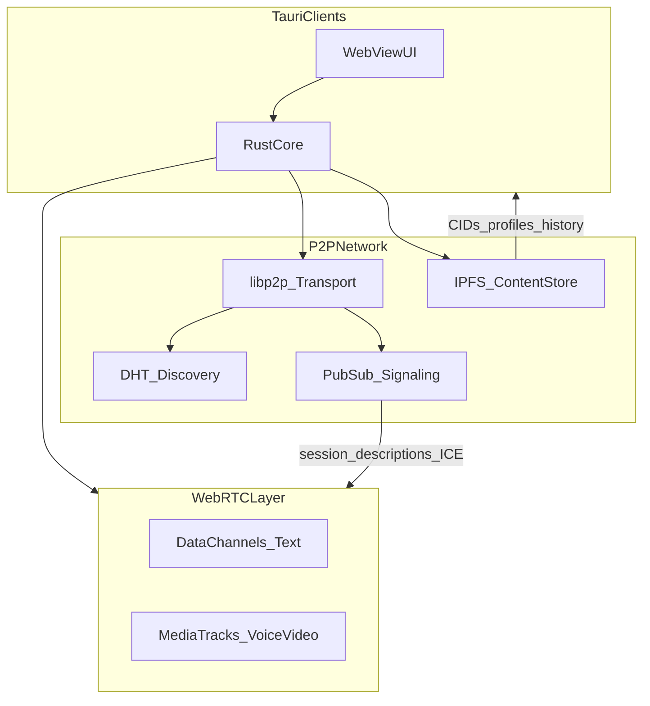
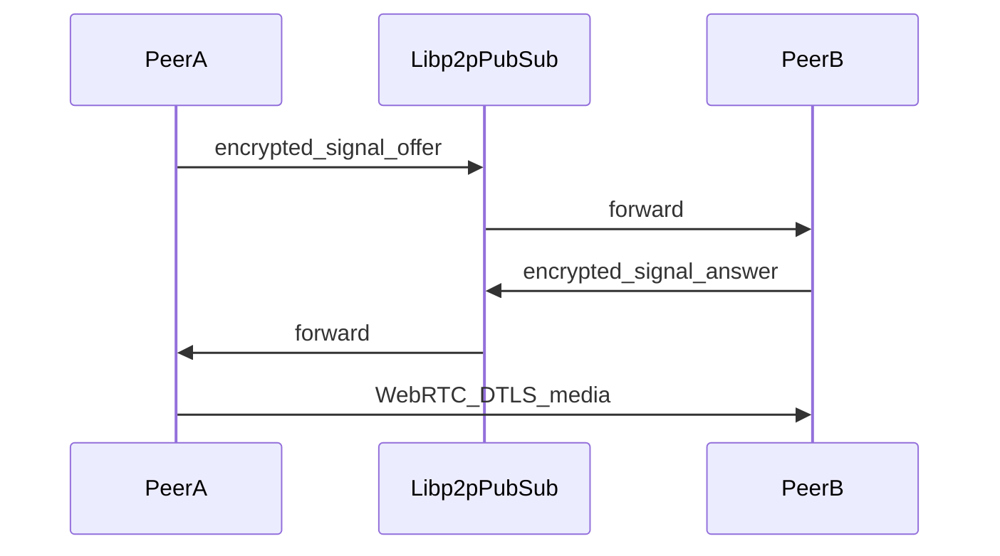

# Vibe: Decentralized Communications Protocol

| Field            | Value                    |
| ---------------- | ------------------------ |
| **Spec version** | `0.2.0-draft`            |
| **Status**       | Draft                    |
| **License**      | MIT ([LICENSE](LICENSE)) |

## 1. Summary

**Vibe** is a free, open-source, fully peer-to-peer communications platform. Users exchange text, voice, and video directly between devices using **WebRTC** for realtime transport and **IPFS** ([content-addressed storage](https://ipfs.tech/)) for durable artifacts they choose to persist. There is no Vibe-operated signaling, storage, or relay infrastructure; optional **community network helpers** (OSS STUN/TURN and libp2p relay/rendezvous) MAY assist NAT traversal (§9.5). End-to-end encryption is mandatory for message and signaling payloads. Clients are built with **Tauri** (Rust core, webview UI) targeting desktop and mobile from a single codebase.

The key words **MUST**, **MUST NOT**, **SHOULD**, **SHOULD NOT**, and **MAY** in this document are to be interpreted as described in [RFC 2119](https://www.rfc-editor.org/rfc/rfc2119).

---

## 2. Goals and Non-Goals

### 2.1 Goals

| Area            | Requirement                                                                                |
| --------------- | ------------------------------------------------------------------------------------------ |
| **Realtime**    | 1:1 and group text; voice; video over WebRTC                                               |
| **Persistence** | User-selected artifacts on IPFS: profiles, attachments, optional encrypted message history |
| **Topology**    | Fully P2P: no Vibe-hosted servers; community-operated OSS helpers MAY assist NAT (§9.5)     |
| **Trust**       | E2EE by default; integrity of published blobs via IPFS CIDs                                |
| **FOSS**        | Reproducible builds; open protocol and schema documentation                                |

### 2.2 Non-Goals (v1)

- Federated or centralized chat servers, SMS bridges, or paid SaaS backends
- Proprietary closed-source TURN/STUN or relay services in the default community catalog (managed hosts running OSS software such as [coturn](https://github.com/coturn/coturn) are permitted; see §9.5)
- Server-based SFU/MCU for large group video (mesh limits are documented instead)
- Blockchain identity, tokens, or on-chain registries
- Platform-wide content moderation or global username reservation
- Push notification infrastructure operated by the Vibe project (see §12.4)

---

## 3. Design Principles

1. **Content addressing** — Immutable public artifacts (profiles, attachments) are referenced by [IPFS CID](https://ipfs.tech/); verification uses the hash of content, not URLs or hostnames.

2. **Location independence** — Peers are identified by cryptographic keys. Network location (IP, NAT type) is ephemeral and MUST NOT be treated as identity.

3. **Fail-open UX, fail-closed security** — Degraded connectivity MAY disable features with clear user feedback. Cryptographic verification failures MUST abort the affected operation; clients MUST NOT fall back to plaintext for user content.

4. **User-controlled network posture** — A curated **community catalog** of OSS, self-hostable network helpers (§9.5) ships with the reference client. **Strict** and **Pragmatic** profiles (§11) share the same catalog for STUN/TURN and libp2p relay/rendezvous; Pragmatic additionally allows custom helpers and IPFS gateways/pinners. Neither profile introduces Vibe-operated infrastructure.

5. **Minimal metadata** — Designs SHOULD minimize metadata exposed on the overlay network; known limits are documented honestly (§13).

---

## 4. High-Level Architecture

### 4.1 Component Diagram



### 4.2 Layer Responsibilities

| Layer               | Responsibility                                                                                                  |
| ------------------- | --------------------------------------------------------------------------------------------------------------- |
| **WebView UI**      | Presentation, local UX state. MUST NOT hold long-lived secrets; MUST NOT perform protocol cryptography.         |
| **Tauri Rust core** | libp2p/IPFS node, identity, session state, envelope encode/decode, WebRTC peer connection lifecycle, IPC to UI. |
| **WebRTC**          | Ephemeral realtime: SCTP data channels (text), RTP media (voice/video). DTLS-SRTP provided by WebRTC stack.     |
| **libp2p**          | Peer routing, DHT, pubsub signaling, optional circuit relay between Vibe peers.                                 |
| **IPFS**            | Content-addressed store for signed profiles, attachments, optional encrypted history segments.                  |

### 4.3 Data Planes

- **Realtime plane** — WebRTC peer connections between conversation members. Active only while peers are online and connected.
- **Overlay plane** — libp2p (DHT, pubsub, relay). Used for discovery, signaling, presence gossip, membership events.
- **Persistence plane** — IPFS blocks/DAGs pinned locally; optional remote pinners in Pragmatic profile (§11).

---

## 5. Identity and Addressing

### 5.1 Peer Identity

- Each human operator has a **root identity**: an Ed25519 keypair generated on-device.
- **Peer ID** — The canonical identifier is the 32-byte Ed25519 public key, encoded for display as base64url (no padding) or multibase per implementation preference. Implementations MUST use the raw public key bytes for protocol logic.
- Private keys MUST remain in the Rust core (OS secure storage where available). They MUST NOT be exported to the webview or IPFS.
- **Desktop persistence (Vibe app):** the keypair is stored as `identity.json` (`vibe-identity/1`: base64url `publicKey` + `privateKey`). Users may export/import this JSON for account recovery.
- **Invite URI:** `vibe://peer/<publicKey>` — public key only; used in QR codes and share links.

### 5.2 Profile Document

- An optional **Profile** (schema `vibe/profile/1`, §A.2) contains display name, avatar CID, bio, and capability flags.
- The Profile MUST be signed by the peer's root key. Clients verify signature before display.
- The latest profile is referenced by CID; older profile CIDs remain valid but SHOULD be ignored after update.

### 5.3 Contacts and Verification

- There is no global username registry. Adding a contact requires knowing their Peer ID (QR code, link, manual entry).
- Clients MUST display a **safety number** (fingerprint of Peer ID) and support out-of-band verification.
- Until verified, clients SHOULD show an unverified state and MAY restrict calling.

### 5.4 Multi-Device (v1 Scope)

- v1 treats one device as **primary** per root identity on a given installation.
- **Multi-device** (device sub-keys signed by root, cross-device history sync) is specified in Appendix A.4 as a future capability; v1 implementations MUST NOT claim cross-device E2EE sync.

### 5.5 Room-Scoped Discovery

- **Room codes** are shared secrets (6–8 alphanumeric characters), not usernames. Clients MUST NOT expose a global searchable directory.
- **Topic derivation**: `room_topic = "vibe/room/" + hex(SHA-256("vibe-room-v1" || uppercase(trim(code))))`.
- While joined to a room, clients MUST publish signed **announce** messages on `room_topic` at a bounded interval (recommended: every 5 seconds) and MUST stop when leaving the room.
- **Announce schema** `vibe/announce/1` (JSON, camelCase on wire):

```json
{
  "type": "vibe/announce/1",
  "peerId": "<base64url Ed25519 pubkey>",
  "displayName": "<ephemeral string>",
  "expiresAt": "<unix ms>",
  "signature": "<base64url Ed25519 signature over canonical payload>"
}
```

- The signed payload MUST exclude `signature` and MUST use the same field order as above.
- Recipients MUST reject announces with invalid signatures, expired `expiresAt`, or `peerId` equal to self.
- **Room → contact flow (Option A)**: Room membership grants discovery only; 1:1 messaging requires adding the peer as a contact (§5.3).

---

## 6. Cryptography

### 6.1 Algorithms

| Purpose                      | Algorithm                            |
| ---------------------------- | ------------------------------------ |
| Identity signing             | Ed25519                              |
| Key agreement (1:1)          | X25519 via Noise                     |
| Symmetric encryption         | XChaCha20-Poly1305                   |
| Hashing / conversation IDs   | SHA-256                              |
| Attachment/content integrity | Multihash per IPFS (SHA-256 default) |

### 6.2 Direct (1:1) Sessions

- v1 **MUST** establish 1:1 messaging keys using **Noise XX** pattern over an authenticated libp2p stream or initial WebRTC data channel bootstrap as defined in §9.3.
- Session state MUST be persisted locally encrypted at rest.
- **Double Ratchet** for offline/async message gaps is a **Phase M3** enhancement (§16); until then, peers that were offline during send rely on optional IPFS history backup (§7) or message loss with user-visible notice.

### 6.3 Group Messaging (v1)

- Groups **MUST** use **Sender Keys** (chain per sender, distributed on member join).
- Maximum group size for Sender Key distribution: **50** members.
- **MLS** ([RFC 9420](https://www.rfc-editor.org/rfc/rfc9420)) is the documented target for a future spec revision; v1 implementations MUST NOT mix MLS and Sender Keys on the same conversation.

### 6.4 WebRTC Media

- Voice and video **MUST** use DTLS-SRTP as implemented by the WebRTC stack.
- Additional E2EE (insertable streams) is out of scope for v1.

### 6.5 IPFS Published Content

- All user content uploaded to IPFS **MUST** be **encrypt-then-publish** with keys available only to intended recipients.
- CIDs in the clear MAY appear in manifests; plaintext of message bodies or attachments MUST NOT be pinned.

### 6.6 Signing

- Profile updates, `GroupManifest` revisions, and membership events **MUST** be signed by the acting peer's root key (or delegated device key when Appendix A.4 is implemented).

---

## 7. IPFS Usage

### 7.1 Persisted vs Ephemeral

| Data                      | IPFS?    | Notes                             |
| ------------------------- | -------- | --------------------------------- |
| Signed profile            | Yes      | Immutable; new version = new CID  |
| Public key bundle         | Yes      | May be embedded in profile        |
| Attachments / large media | Yes      | Chunked; encrypted                |
| Message history backup    | Optional | User opt-in; encrypted CAR or DAG |
| ICE candidates / SDP      | No       | Ephemeral pubsub only             |
| Typing / presence         | No       | Ephemeral pubsub only             |
| Active call state         | No       | WebRTC session only               |

### 7.2 Pinning Model

- Each client **MUST** pin content it publishes locally.
- Recipients **SHOULD** pin attachments they wish to retain.
- Availability is best-effort: no guarantee without sufficient replicas. Pragmatic profile MAY use user-configured remote pinners (§11).

### 7.3 Content Types

| Schema ID               | Description                           |
| ----------------------- | ------------------------------------- |
| `vibe/profile/1`        | Signed user profile                   |
| `vibe/attachment/1`     | Encrypted blob metadata + chunk CIDs  |
| `vibe/history/1`        | Encrypted message log segment (M3)    |
| `vibe/group-manifest/1` | Signed group metadata and member list |

Encoding **SHOULD** be CBOR for canonical hashing; JSON MAY be accepted for debugging if CBOR is normative on wire.

### 7.4 Retrieval

- Peers **MUST** fetch via libp2p/IPFS bitswap from connected peers.
- Pragmatic profile MAY allow read-only HTTP gateway URLs for fetch-only (§11); Strict profile MUST NOT.

---

## 8. WebRTC Realtime Plane

### 8.1 Peer Connections

- One `RTCPeerConnection` (or equivalent) per remote peer in a conversation for v1.
- Group calls use **full mesh**: each pair negotiates media as needed.

### 8.2 Text (Data Channels)

- **MUST** use an ordered, reliable SCTP data channel per 1:1 peer connection (labeled `vibe/text`).
- Application frames **MUST** be length-prefixed CBOR envelopes (§15.2) containing `protocol_version`, `conversation_id`, `seq`, and ciphertext produced by the session keys (§6).
- **Vibe v1 reference:** the desktop/mobile client uses JSON `WireChat` on the data channel and gossipsub (same ciphertext layout as §6); CBOR length-prefixing is a follow-up.

### 8.3 Voice and Video

| Mode       | Topology                                                                |
| ---------- | ----------------------------------------------------------------------- |
| 1:1 call   | Single peer connection with audio + optional video tracks               |
| Group call | Mesh; max **4** simultaneous media participants (`VIBE_GROUP_MESH_MAX`) |

- Beyond `VIBE_GROUP_MESH_MAX`, clients **MUST** warn the user and **SHOULD** offer audio-only or async IPFS attachment fallback. SFU/TURN operated by Vibe is prohibited. Community-operated TURN (e.g. coturn-based relays in §9.5) is permitted.

### 8.4 Codecs (Informative)

- Audio: Opus preferred.
- Video: VP9 or AV1 where hardware permits; negotiate via SDP.

### 8.5 Connection Lifecycle

- Clients **MUST** renegotiate ICE on network change.
- Hang up **MUST** close peer connections and stop media tracks.

---

## 9. Signaling and Discovery

### 9.1 Discovery

- Peers **MUST** participate in libp2p **Kademlia DHT** for routable peer records.
- **Bootstrap peers**: a signed, community-maintained list MAY ship with the app; it MUST NOT be exclusive Vibe infrastructure. Users MAY override or disable bootstrap list entries.
- **Rendezvous** (libp2p rendezvous protocol) **MAY** be used for topic-based discovery.

### 9.2 Signaling Transport



- Signaling messages **MUST** be published on gossipsub topic `vibe/signal/<conversation_id>` where `conversation_id` is defined in §10.1.
- Payloads **MUST** be encrypted to all current conversation members (1:1 or group envelope).
- SDP offers/answers and ICE candidates **MUST** travel only inside these encrypted envelopes.

### 9.3 Initial Key Bootstrap

- If no Noise session exists, peers **MUST** complete Noise XX over a libp2p protocol stream `/vibe/noise/1` before trusting signaling payloads.
- WebRTC signaling **MUST NOT** proceed until the Noise handshake completes successfully.

### 9.4 ICE and NAT

NAT traversal spans two layers that MUST be distinguished in implementations and UX:

| Layer | Mechanism | Purpose |
| ----- | --------- | ------- |
| **Overlay** | libp2p circuit relay, rendezvous, DHT | Gossipsub signaling, message fallback, peer discovery |
| **WebRTC** | STUN, TURN | ICE for data channels and media (DTLS-SRTP) |

Signaling MAY succeed on the overlay while WebRTC media or data channels still fail if ICE cannot find a path; clients **SHOULD** surface these states separately.

| Profile       | ICE behavior                                                                                          |
| ------------- | ----------------------------------------------------------------------------------------------------- |
| **Strict**    | Host + srflx; **community-catalog** STUN/TURN (§9.5); libp2p circuit relay via catalog or peer relay |
| **Pragmatic** | Same catalog **enabled by default**; user **MAY** add additional OSS or self-hosted STUN/TURN       |

- Default Pragmatic install **MUST** enable the community catalog STUN/TURN entries (§9.5.3).
- Default install **MUST NOT** enable proprietary or non-catalog third-party endpoints (e.g. closed-source TURN APIs, proprietary STUN such as `stun.l.google.com`).

### 9.5 Community Network Helpers

Community network helpers are publicly operated endpoints running **free/open-source, self-hostable** server software. They assist connectivity but are not Vibe-operated infrastructure.

#### 9.5.1 Eligibility Criteria

A catalog entry **MUST** satisfy all of the following:

1. **FOSS software** — The server runs software with a public source repository and an OSI-approved or equivalent open license (e.g. [coturn](https://github.com/coturn/coturn) for STUN/TURN, libp2p for relay/rendezvous).
2. **Self-hostable** — Any operator **MAY** deploy an equivalent instance from that source without proprietary dependencies.
3. **Community-operated** — The endpoint is operated by a third party, not the Vibe project.
4. **Catalog-listed** — The entry appears in the **Vibe community catalog** with at minimum: `id`, `kind` (`stun` | `turn` | `libp2p-relay` | `libp2p-rendezvous`), `urls`, and for TURN: `username`/`credential` or a documented credential scheme (e.g. TURN REST). Informative fields **SHOULD** include `software`, `license`, `sourceUrl`, `operator`, and `privacyUrl`.
5. **No proprietary defaults** — Implementations **MUST NOT** add closed-source relay services to the default catalog.

#### 9.5.2 Catalog vs User Overrides

- The default catalog **MUST** ship with the reference client (embedded JSON or bootstrap constants).
- Active helpers are stored in app data as `network-helpers.json` with fields: `relayPeers`, `rendezvousPeers`, `stunServers`, `turnServers`.
- **Pragmatic**: user edits **MAY** merge with or override catalog entries; custom OSS or self-hosted endpoints beyond the catalog are allowed.
- **Strict**: only catalog entries **MUST** be honored; user-supplied `stunServers`, `turnServers`, `relayPeers`, or `rendezvousPeers` **MUST NOT** be applied if they are not in the catalog.

#### 9.5.3 Default Catalog (Pragmatic Factory Install)

The reference client **MUST** ship with at least the following enabled STUN/TURN entries in Pragmatic profile:

| Kind | Endpoint (informative) | Notes |
| ---- | ---------------------- | ----- |
| STUN | `stun:stun.relay.metered.ca:80` | coturn STUN; OSS alternative to proprietary STUN |
| TURN | [Open Relay](https://www.metered.ca/tools/openrelay/) — `turn:openrelay.metered.ca:80`, `turn:openrelay.metered.ca:443`, `turn:openrelay.metered.ca:443?transport=tcp`; username/credential `openrelayproject` | coturn-based community relay; clients **SHOULD** document rate/abuse limits in UX |
| libp2p relay | *(none in v1)* | Catalog slot reserved; entries added when community relays are vetted |
| libp2p rendezvous | *(none in v1)* | Catalog slot reserved; entries added when community servers are vetted |

Informative example (see also §B.4):

```json
{
  "catalogVersion": 1,
  "stunServers": ["stun:stun.relay.metered.ca:80"],
  "turnServers": [{
    "urls": [
      "turn:openrelay.metered.ca:80",
      "turn:openrelay.metered.ca:443",
      "turn:openrelay.metered.ca:443?transport=tcp"
    ],
    "username": "openrelayproject",
    "credential": "openrelayproject"
  }]
}
```

#### 9.5.4 Operational Requirements

- Clients **MUST** disclose which catalog entries are active before the first call or cross-network message attempt on a new network.
- Clients **MUST** log locally (not transmit) when a community helper is used for a given operation.
- Changing active helpers **MUST** invalidate any ICE server cache and recycle existing `RTCPeerConnection` instances on the next connection attempt.

#### 9.5.5 Privacy and Trust

- Community TURN operators can observe connection **metadata** (IP addresses, ports, timing, bandwidth). Media and application payloads remain protected by DTLS-SRTP and session encryption respectively.
- Clients **SHOULD** link to self-hosting documentation (e.g. coturn) in network settings or help text.
- Users **MAY** disable catalog TURN entries or self-host coturn if they do not trust a community operator.

---

## 10. Conversation Models

### 10.1 Conversation ID

- **Direct**: `conversation_id = SHA-256(sort(peer_id_a, peer_id_b))` where sort is lexicographic on raw 32-byte keys.
- **Group**: `conversation_id = SHA-256(group_manifest_cid_bytes)` after first manifest publish.

### 10.2 Direct Conversations

- Exactly two members. Either peer MAY initiate text or call.
- Block list is local: blocked Peer IDs MUST NOT receive decrypted processing; signaling MAY be dropped silently.

### 10.3 Group Conversations

- Creator publishes `vibe/group-manifest/1` to IPFS and distributes CID via pubsub `vibe/group/announce`.
- Membership changes (add/remove) **MUST** be signed events; manifest CID updates chain via `prev_manifest_cid`.
- New members **MUST** receive Sender Keys from all current senders before decrypting group traffic.

### 10.4 Presence

- Heartbeats **MAY** be sent on `vibe/presence/<conversation_id>` at most once per 60 seconds per peer.
- Presence is ephemeral; not stored on IPFS unless history backup includes system events (opt-in).

### 10.5 Typing and Read Receipts

- **MAY** use ephemeral pubsub on `vibe/ephemeral/<conversation_id>`.
- **MUST NOT** persist to IPFS unless user enables history backup including metadata events.

---

## 11. Network Profiles

Vibe defines two network profiles. The active profile **MUST** be visible in settings. Switching profiles **MUST** take effect on the next connection attempt.

### 11.1 Comparison

| Capability                                      | Strict                          | Pragmatic                              |
| ----------------------------------------------- | ------------------------------- | -------------------------------------- |
| Community OSS STUN/TURN (catalog, §9.5)           | Allowed (same entries)          | Allowed, **enabled by default**          |
| Custom STUN/TURN beyond catalog                 | **MUST NOT**                    | **MAY**                                |
| Custom libp2p relay/rendezvous beyond catalog     | **MUST NOT**                    | **MAY**                                |
| Third-party IPFS HTTP gateway (read-only)         | **MUST NOT** use                | **MAY** use user-configured URLs       |
| Remote IPFS pinners                               | **MUST NOT** use                | **MAY** use user-configured endpoints  |
| libp2p circuit relay via other Vibe peers         | Allowed                         | Allowed                                |
| Vibe-operated servers                             | **MUST NOT** exist              | **MUST NOT** exist                     |

### 11.2 Default Behavior

- Factory default profile: **Pragmatic** with the community STUN/TURN catalog **enabled** (§9.5.3); IPFS gateway and pinner lists empty.
- Implementations **MUST** log (locally, not transmit) when community or custom helpers are used for a given operation.

### 11.3 Strict Profile Requirements

- All IPFS retrieval **MUST** occur over libp2p/bitswap from peers.
- Only **catalog** network helpers **MAY** be used for STUN, TURN, libp2p relay, and rendezvous; custom third-party endpoints **MUST NOT** be honored.
- Clients **SHOULD** surface connectivity guidance when connections fail behind symmetric NAT even with catalog TURN.

### 11.4 Pragmatic Profile Requirements

- Community catalog STUN/TURN **MUST** be toggleable; user-added STUN/TURN **MUST** be editable and clearable.
- Custom TURN beyond the catalog **MUST** run OSS server software or be self-hosted by the user.
- Remote pinners **MUST NOT** receive decryption keys; they store ciphertext only.

---

## 12. Tauri Implementation Notes

_This section is informative for implementers; it does not mandate specific crate versions._

### 12.1 Process Model

- **Rust core** owns: libp2p swarm, IPFS blockstore, Noise sessions, WebRTC `PeerConnection` factory, SQLite or sled for local encrypted state.
- **Webview** communicates via Tauri commands/events; IPC payloads **MUST NOT** contain private keys or plaintext message bodies except for display of already-decrypted content in RAM.

### 12.2 Indicative Rust Ecosystem

| Concern       | Indicative crates / APIs                                            |
| ------------- | ------------------------------------------------------------------- |
| P2P transport | `libp2p`                                                            |
| IPFS          | `ipfs-embed`, `rust-ipfs`, or controlled `kubo` sidecar (see §B.3)  |
| WebRTC        | `webrtc` (pure Rust) or platform WebRTC via Tauri mobile plugins    |
| Crypto        | `ed25519-dalek`, `x25519-dalek`, `chacha20poly1305`, `snow` (Noise) |

### 12.3 Platform Notes

- **Desktop**: full background connectivity; IPFS node **SHOULD** run while app is open.
- **Mobile**: OS may suspend background tasks; incoming calls while suspended are best-effort without push (§12.4).
- **Permissions**: camera, microphone, notifications (local only), filesystem access scoped per OS guidelines.

### 12.4 Background and Incoming Sessions

- Pure P2P v1 has **no** Vibe push gateway. Peers discover each other when both are online on the overlay.
- Implementations **SHOULD** document platform limitations (iOS/Android background execution) honestly in user-facing help.

---

## 13. Security and Threat Model

### 13.1 Assets

- Message plaintext, media streams, private keys, contact list, local session state.

### 13.2 Threats and Mitigations

| Threat                    | Mitigation                                                                       |
| ------------------------- | -------------------------------------------------------------------------------- |
| MITM on signaling         | Noise handshake before signaling; encrypted SDP/ICE inside group/direct envelope |
| Impersonation             | Safety numbers; signed profiles and manifests                                    |
| Tampering with IPFS blobs | CID verification; signatures on manifests; decrypt-then-authenticate             |
| Replay (pubsub)           | Seq numbers in envelopes; session nonces in Noise                                |
| Malicious peer flood      | Rate limits; block list; gossipsub mesh limits                                   |

### 13.3 Known Limitations

- **Metadata**: Pubsub topics and timing leak conversation activity; padding and sealed sender are future work (v2).
- **Availability**: IPFS content may be unreachable if no peer pins it.
- **Group video scale**: Mesh is O(n²); capped at `VIBE_GROUP_MESH_MAX`.
- **Offline 1:1**: Without M3 ratchet/history, messages sent while recipient is offline may be lost unless history backup is enabled.

### 13.4 Responsible Disclosure

Security issues **SHOULD** be reported via the repository's `SECURITY.md` when published. Embargo and credit practices follow maintainer policy.

---

## 14. Privacy, Legal, and Abuse

- **Moderation**: There is no global moderation layer. Users control block lists locally.
- **Export / delete**: Clients **MUST** offer export of local data and deletion of local state; IPFS unpublish is best-effort (stop pinning; cannot erase all remote copies).
- **Compliance**: Age gating and regional telecom rules are the responsibility of distributors, not this spec.
- **Illegal content**: Implementers **SHOULD** document that users are responsible for content they publish to the public IPFS network.

---

## 15. Protocol Versioning and Interoperability

### 15.1 Spec and Protocol Version

- This document uses semver for spec releases.
- Every wire envelope **MUST** include `protocol_version` (string, e.g. `"1"`).

### 15.2 Envelope Format (normative sketch)

```cbor
{
  "protocol_version": "1",
  "type": "text" | "signal" | "membership" | ...,
  "conversation_id": <32 bytes>,
  "seq": <uint64>,
  "sender_peer_id": <32 bytes>,
  "ciphertext": <bytes>,
  "timestamp": <uint64 unix ms>
}
```

- `ciphertext` **MUST** cover the inner payload for the given `type`.
- Unknown `protocol_version` **MUST** reject with user-visible error.

### 15.3 Capability Negotiation

- During Noise handshake, peers **MUST** exchange `Capabilities` struct: supported profiles, max mesh size, history backup, codec preferences.
- Intersection of capabilities **MUST** be used for the session.

### 15.4 Independent Implementations

Any client implementing `vibe/*` schemas, §6 crypto, §9 signaling, and §8 WebRTC framing **SHOULD** interoperate with Vibe reference clients of the same `protocol_version`.

---

## 16. Phased Delivery Roadmap

| Phase  | Deliverables                                                                                   | Exit criteria                                                            |
| ------ | ---------------------------------------------------------------------------------------------- | ------------------------------------------------------------------------ |
| **M0** | Tauri shell; root identity; libp2p connect; Noise handshake; 1:1 text over WebRTC data channel | Two clients exchange encrypted text with no central server               |
| **M1** | 1:1 voice/video; `vibe/profile/1` on IPFS; `vibe/attachment/1`                                 | Verified profile CID; completed voice call; file round-trip via CID      |
| **M2** | Groups (text); Sender Keys; Strict/Pragmatic settings UI; group manifest                       | 5-member group text; catalog toggles, custom helpers (Pragmatic), helper-change reconnect |
| **M3** | Optional `vibe/history/1` on IPFS; Double Ratchet for async 1:1; multi-device (Appendix A.4)   | Offline message delivery after reconnect; second device receives history |

Dependencies: M1 depends on M0; M2 depends on M0; M3 depends on M1 and M2.

---

## 17. Appendices

The following appendices provide schemas, glossary, references, and open implementation questions.

### Appendix A: Schemas and Examples

### A.1 Glossary

| Term            | Definition                                                   |
| --------------- | ------------------------------------------------------------ |
| **CID**         | Content Identifier — hash-based address for IPFS data        |
| **DHT**         | Distributed hash table for peer routing (libp2p Kademlia)    |
| **DTLS-SRTP**   | WebRTC media encryption                                      |
| **E2EE**        | End-to-end encryption                                        |
| **ICE**         | Interactive Connectivity Establishment for NAT traversal     |
| **MLS**         | Messaging Layer Security (group E2EE standard, future)       |
| **Noise**       | Framework for mutual key exchange (XX pattern in v1)         |
| **Peer ID**     | 32-byte Ed25519 public key identifying a user                |
| **Pubsub**      | Gossipsub topic-based broadcast on libp2p                    |
| **SDP**         | Session Description Protocol for WebRTC negotiation          |
| **Sender Keys** | Per-sender symmetric chain for group encryption (v1)         |
| **STUN/TURN**   | NAT discovery / relay protocols; community OSS catalog (§9.5); enabled by default in Pragmatic |
| **Community Network Helper** | Public OSS, self-hostable endpoint (STUN, TURN, libp2p relay/rendezvous) listed in the Vibe community catalog |

### A.2 Example Profile (`vibe/profile/1`)

```json
{
  "schema": "vibe/profile/1",
  "peer_id": "<32-byte-ed25519-pubkey-base64url>",
  "display_name": "Ada",
  "avatar_cid": "bafy...",
  "bio": "Building peer-to-peer tools.",
  "capabilities": {
    "protocol_version": "1",
    "history_backup": false,
    "group_mesh_max": 4
  },
  "issued_at": 1717536000000,
  "signature": "<ed25519-signature-bytes-base64url>"
}
```

On wire, implementations **SHOULD** use canonical CBOR; JSON above is illustrative.

### A.3 Example Attachment Metadata (`vibe/attachment/1`)

```json
{
  "schema": "vibe/attachment/1",
  "conversation_id": "<32-byte-hex>",
  "filename": "diagram.png",
  "mime_type": "image/png",
  "size": 1048576,
  "chunk_cids": ["bafy...", "bafy..."],
  "encryption": {
    "algorithm": "XChaCha20-Poly1305",
    "nonce": "<bytes>"
  },
  "signature": "<ed25519-signature>"
}
```

### A.4 Multi-Device (Future)

- Root key signs **device keys** (separate Ed25519 per device).
- `vibe/device/1` document lists device public keys and expiration.
- IPFS history segments encrypted to a group key rotated on membership change.
- Not required for M0–M2 compliance.

---

### Appendix B: References and Open Questions

### B.1 Normative and Informative References

- [IPFS — content addressing and distributed storage](https://ipfs.tech/)
- [libp2p specification](https://github.com/libp2p/specs)
- [WebRTC 1.0](https://www.w3.org/TR/webrtc/)
- [RFC 2119 — requirement keywords](https://www.rfc-editor.org/rfc/rfc2119)
- [RFC 9420 — MLS](https://www.rfc-editor.org/rfc/rfc9420) (future group crypto)
- [Noise Protocol Framework](https://noiseprotocol.org/)
- [Tauri](https://tauri.app/) — cross-platform client shell
- [coturn](https://github.com/coturn/coturn) — reference OSS STUN/TURN server
- [Metered Open Relay](https://www.metered.ca/tools/openrelay/) — community coturn TURN (informative default)

### B.2 Constants

| Constant                        | Value                              |
| ------------------------------- | ---------------------------------- |
| `VIBE_GROUP_MESH_MAX`           | 4                                  |
| `VIBE_GROUP_SENDER_KEYS_MAX`    | 50                                 |
| `VIBE_PRESENCE_INTERVAL_SEC`    | 60                                 |
| Noise protocol name             | `Noise_XX_25519_ChaChaPoly_SHA256` |
| libp2p noise stream protocol ID | `/vibe/noise/1`                    |

### B.3 Open Questions (Implementation Time)

1. **IPFS embedding** — `rust-ipfs` / `ipfs-embed` vs bundled `kubo` sidecar: tradeoffs for mobile binary size and battery.
2. **WebRTC on mobile Tauri** — pure Rust `webrtc` crate vs platform WebRTC bindings for hardware codecs.
3. **Topic privacy** — whether v2 should use encrypted topic names derived from `conversation_id`.
4. **Sealed sender** — whether pubsub envelopes should hide `sender_peer_id` from non-members on encrypted topics.
5. **Bootstrap list governance** — community signing keys and update cadence for default bootstrap peers.
6. **Community catalog governance** — signing keys, vetting process, and update cadence for default STUN/TURN/relay entries (parallel to bootstrap list).

### B.4 Default Community Catalog (Informative)

Reference v1 catalog entries for WebRTC NAT traversal:

| Field | Value |
| ----- | ----- |
| **STUN** | `stun:stun.relay.metered.ca:80` |
| **TURN URLs** | `turn:openrelay.metered.ca:80`, `turn:openrelay.metered.ca:443`, `turn:openrelay.metered.ca:443?transport=tcp` |
| **TURN credentials** | username `openrelayproject`, credential `openrelayproject` (static; community free tier) |
| **Server software** | [coturn](https://github.com/coturn/coturn) (BSD-3-Clause) |
| **Operator docs** | [openrelay.metered.ca](https://www.metered.ca/tools/openrelay/) |

Optional informative metadata (not required on the `network-helpers.json` wire):

```json
{
  "meta": {
    "software": "coturn",
    "sourceUrl": "https://github.com/coturn/coturn",
    "operator": "Metered.ca (community free tier)",
    "docsUrl": "https://www.metered.ca/tools/openrelay/"
  }
}
```

---

## Document History

| Version       | Date       | Changes       |
| ------------- | ---------- | ------------- |
| `0.2.0-draft` | 2026-06-11 | Community network helpers (§9.5); OSS STUN/TURN catalog with Open Relay defaults; Strict/Pragmatic profile clarification |
| `0.1.0-draft` | 2026-06-04 | Initial draft |

---
