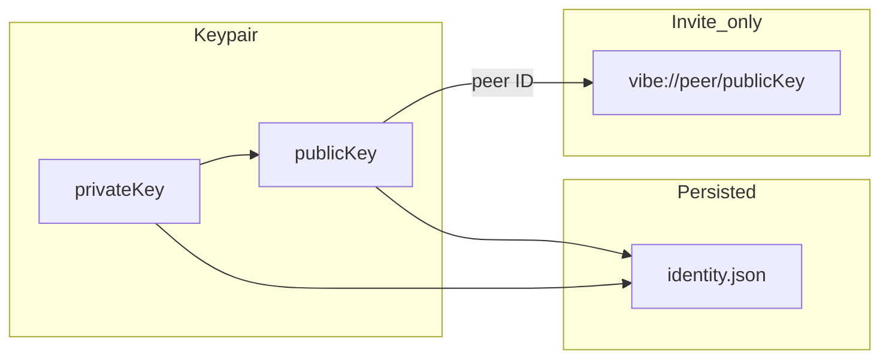

# 0002 — Identity, QR invite, and key backup

| Field | Value |
|-------|-------|
| **Status** | done |
| **SPEC** | [§5 Identity and addressing](../SPEC.md) |
| **Depends on** | [0001](./0001.md) (chat UI, ephemeral store, libp2p shell) |

## Goal

Give every user a stable **Ed25519 keypair** where the **public key is the peer ID**, with a scannable **invite QR**, and a **keypair-only backup** for account recovery. Contacts and messages stay ephemeral (no database).

## Principles

| Persisted | Ephemeral (session) |
|-----------|---------------------|
| `identity.json` — public + private keys | Contacts, messages, session keys |
| User may **regenerate** keys (destructive) | Cleared on regenerate or import |

**Account recovery** = restore the same public + private key backup. Nothing else is required.

---

## Key model

- **Algorithm:** Ed25519 (32-byte seed / keys), aligned with [SPEC §5.1](../SPEC.md)
- **Peer ID:** base64url encoding of the 32-byte **public** key (no padding)
- **libp2p:** derive `Keypair` from the same secret bytes (existing swarm behavior)



---

## On-disk and backup format

Single schema used for both app storage and user export (`vibe-identity/1`):

```json
{
  "version": 1,
  "publicKey": "<base64url, 32 bytes>",
  "privateKey": "<base64url, 32 bytes>"
}
```

- `publicKey` **is** the peer ID string shown in the UI
- Import **must** verify that `privateKey` derives to `publicKey` before saving
- Migrate once from legacy `identity.protobuf` if present, then write `identity.json`

**Invite URI (QR payload):**

```
vibe://peer/<publicKey>
```

Public only — never encode the private key in a QR code.

---

## Rust (`src-tauri`)

### [identity.rs](../src-tauri/src/identity.rs)

| API | Purpose |
|-----|---------|
| `Identity::generate()` | New random keypair |
| `Identity::from_backup(json)` | Parse + validate pair |
| `Identity::load_or_create(dir)` | Startup; migrate protobuf → JSON |
| `Identity::save(dir)` | Persist after generate/import/regenerate |

### New Tauri commands ([lib.rs](../src-tauri/src/lib.rs))

| Command | Behavior |
|---------|----------|
| `get_identity` | `{ peerId, publicKey, privateKey }` for UI |
| `export_identity_backup` | Return canonical JSON string |
| `import_identity_backup` | Validate, save, swap identity, clear store, restart network |
| `regenerate_identity` | New keys, save, swap, clear store, restart network |

### App state

- Hold `identity` in `Arc<RwLock<Identity>>` (or equivalent) so import/regenerate can swap without restarting the app
- `EphemeralStore::clear()` on identity change
- [network.rs](../src-tauri/src/network.rs): `NetworkCommand::Restart` after identity swap so libp2p uses the new key

### Plugins and capabilities (Tauri v2)

Use `cargo tauri add dialog` (see [tauri-v2 skill](../.agents/skills/tauri-v2/SKILL.md)).

**Prefer Rust-side file backup** (recommended): dialog + `std::fs` inside commands, not JS `plugin-fs` on arbitrary user paths (avoids fs scope pitfalls).

| Command | Role |
|---------|------|
| `export_identity_backup` | Return JSON string (for paste / copy) |
| `export_identity_backup_file` | Open save dialog in Rust, write JSON to chosen path |
| `import_identity_backup` | Parse JSON from string (paste) |
| `import_identity_backup_file` | Open dialog in Rust, read file, then import |

Register in `lib.rs`:

```rust
.plugin(tauri_plugin_dialog::init())
.invoke_handler(tauri::generate_handler![
    // existing + get_identity, export_identity_backup,
    // export_identity_backup_file, import_identity_backup,
    // import_identity_backup_file, regenerate_identity,
])
```

[capabilities/default.json](../src-tauri/capabilities/default.json) — add explicitly:

```json
"dialog:allow-open",
"dialog:allow-save"
```

Skip `tauri-plugin-fs` for 0002 unless you intentionally want frontend file I/O with scoped `$DOWNLOADS/**` (or similar).

**Native vs browser:** Tauri plugins (e.g. `dialog`) run in the **Tauri shell** (desktop/mobile) and call **native** save/open dialogs. The UI is a webview, but this is not a standalone browser tab — `invoke` and plugins do **not** work under `bun run dev` / Vite alone without `tauri dev`. There is no separate “browser client” in 0002; invitees using only Chrome would need a future web build (out of scope).

### IPC and errors

- All new commands in `generate_handler![]` (silent failure if missing).
- Use `Result<T, AppError>` with `AppError: Serialize` for import/regenerate failures ([ipc-patterns](../.agents/skills/tauri-v2/references/ipc-patterns.md)).
- Sync commands are fine for key/crypto work; use `async` only if calling async dialog APIs from Rust.
- Use `app.path().app_data_dir()` for `identity.json` — never hardcode paths.

### Identity in `AppState`

- Today `NetworkHandle::new` **moves** `Arc<Identity>` into a long-lived swarm task ([network.rs](../src-tauri/src/network.rs)).
- Use `Arc<RwLock<Identity>>` in `AppState` **and** `NetworkCommand::Restart` that **re-spawns** the swarm with a fresh `Arc<Identity>` (swarm cannot hot-swap libp2p keypair in place).
- On restart: leave room, clear `EphemeralStore`, spawn new `run_swarm` task (use cancel flag or single supervisor task to avoid two swarms).

### Security (IPC boundary)

- `get_identity` should default to `{ peerId, publicKey }` only.
- Expose `privateKey` only via explicit `reveal_private_key` or inside Rust file export — avoid keeping private key in React state unless user toggles “Show recovery key”.
- `export_identity_backup` JSON over IPC is acceptable for paste flow; warn in UI.

---

## Frontend

### Dependencies

- `react-qr-code` (or equivalent) — render invite QR

### [src/lib/tauri.ts](../src/lib/tauri.ts)

| Helper | Behavior |
|--------|----------|
| `getIdentity()` | `{ peerId, publicKey }` for invite UI |
| `revealPrivateKey()` | Optional; only when user expands recovery key |
| `exportIdentityBackup()` | JSON string (copy/paste) |
| `exportIdentityBackupFile()` | Invoke Rust command (dialog + write in Rust) |
| `importIdentityFromPaste(json)` | `import_identity_backup` |
| `importIdentityBackupFile()` | Invoke Rust command (dialog + read in Rust) |

Use `invoke` from `@tauri-apps/api/core` only — no v1 `@tauri-apps/api/tauri` import.

### [src/lib/peer-id.ts](../src/lib/peer-id.ts) (new)

- `parsePeerId(input)` — accept raw base64url or `vibe://peer/...` for add-contact

### UI

Replace **My peer ID** dialog with **Identity** ([discovery-dialogs.tsx](../src/components/chat/discovery-dialogs.tsx) or new `identity-dialog.tsx`):

| Section | UI |
|---------|-----|
| **Invite** | QR (`vibe://peer/...`), public key, copy button |
| **Backup** | Export to file; paste JSON + Import; security warning |
| **Advanced** | Regenerate (`AlertDialog`) — new peer ID, invalidates old backup, clears session contacts |

- Private key: hidden by default (“Show recovery key” toggle)
- Sidebar control: label **Identity**, not “My peer ID”

**shadcn:** `Dialog`, `FieldGroup`, `Field`, `AlertDialog`, `Button`, `Textarea`, `Separator` — follow project [shadcn skill](../.agents/skills/shadcn/SKILL.md)

---

## Out of scope (0002)

- QR camera scanning
- IPFS profile documents
- Persisting contacts or message history
- Cloud backup or Vibe-operated accounts

---

## Acceptance criteria

- [x] First launch generates keys; displayed peer ID equals `publicKey`
- [x] Identity dialog shows QR encoding `vibe://peer/<publicKey>`
- [x] Export backup to JSON file; re-import restores the same peer ID
- [x] Paste JSON import works equivalently to file import
- [x] Regenerate creates a new peer ID; previous backup no longer applies
- [x] Import/regenerate clears in-memory contacts; no SQLite added
- [x] Add-contact accepts pasted `vibe://peer/...` URIs

---

## Implementation order

1. `identity.json` format + migration + validation in Rust
2. Tauri commands + serializable errors + `generate_handler!` registration
3. `tauri-plugin-dialog` + capability permissions; Rust file export/import commands
4. `Arc<RwLock<Identity>>` + `EphemeralStore::clear` + swarm **restart** (not in-place key swap)
5. `tauri.ts` helpers + Identity dialog (QR, backup, regenerate)
6. `parsePeerId` helper for add-contact
7. Optional: SPEC §5.1 note for `identity.json` and `vibe://peer/` URI
