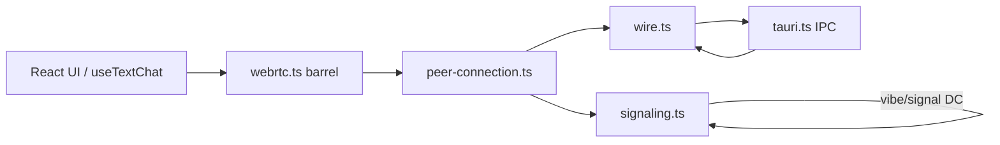

# Transport layer

WebRTC peer connections, encrypted signaling, and chat wire format for the Vibe client.

**Import from `@/lib/webrtc`** (barrel) in app code — not from individual files in this folder.

For platform-level architecture, see [ARCHITECTURE.md](../../../ARCHITECTURE.md). For wire format rules, see [SPEC.md](../../../SPEC.md) §9.

## Modules

| File | Role |
|------|------|
| `types.ts` | Signaling message types, envelope shapes, call/text discriminated unions |
| `signaling.ts` | `vibe/signal` DC when open; else gossipsub via Rust overlay, encrypt/decrypt via Tauri |
| `noise-handshake.ts` | Noise XX over `vibe/noise` data channel |
| `wire.ts` | Data channel bytes and message ingest |
| `rtc-utils.ts` | SDP helpers, channel labels, polite/impolite role |
| `ice-buffer.ts` | Queued ICE candidates (inbound, outbound, orphan call ICE) |
| `peer-connection.ts` | Single `RTCPeerConnection` per peer (text + signal + noise DCs + call media) |
| `register.ts` | Bootstraps default signaling routes at import (side effect) |

## Rules

- `signaling.ts` and `wire.ts` never import `RTCPeerConnection` — they only move encrypted bytes.
- **Single PC model:** one `RTCPeerConnection` per remote peer carries text, signaling, noise, and call media.
- **Polite / impolite negotiation:** the peer with the lexicographically **higher** Peer ID is the offerer for manual SDP exchange and Noise initiator.
- `registerSignalingRoutes` **merges** partial route maps — callers add handlers without wiping existing routes.

## Connection bootstrap

**Primary (auto-connect):**

1. Add contact via QR (`vibe://peer/…`), deep link, or pasted peer ID.
2. Establish a **libp2p TCP connection** to the contact (explicit `dial_contact` multiaddrs or inbound dial).
3. Open the contact's chat on both sides → `useAutoConnect` runs `ensureTextTransport` when the contact is a connected overlay peer.
4. Impolite peer (higher peer ID) publishes an SDP offer on gossipsub `vibe/signal/<conversation_id>`; polite peer answers.
5. After WebRTC connects → Noise XX on `vibe/noise`, then chat on `vibe/text`.

**Fallback:** Advanced → manual `vibe://connect` links — see [`connect-uri.ts`](../connect-uri.ts) and [`connect-handler.ts`](../connect-handler.ts).

No LAN/mDNS, bootstrap, relay, or DHT in the overlay — gossipsub only among **connected** libp2p peers.

## Data flow (text)

1. UI calls `sendTextMessage` via the barrel.
2. If the text data channel is open and Noise is ready, `wire.ts` sends encrypted bytes on the DC.
3. Otherwise the message is persisted as **pending** and flushed when the session is ready.

## Data flow (calls)

1. `calls.ts` owns call state (invite, accept, decline, end) and media streams.
2. `peer-connection.ts` attaches call tracks to the shared PC per peer.
3. Call signaling uses the encrypted `vibe/signal` data channel with `call-*` message types.
4. UI subscribes via `subscribeCallState` / `getCallSnapshot` (external store, not React).

## Public API

Re-exported from `@/lib/webrtc`:

| Export | Purpose |
|--------|---------|
| `ensurePeerConnection`, `createConnectionOffer`, `closePeerConnection`, … | PC lifecycle |
| `sendTextMessage`, `flushPendingMessages`, `isTextChannelOpen`, `subscribeTransportState` | DC chat send |
| `ensureCallPeerConnection`, `closeCallPeerConnection`, … | Call PC lifecycle (used by `calls.ts`) |
| `registerSignalingRoutes`, `publishSignalingMessage`, … | Signaling hooks |
| `TEXT_CHANNEL_LABEL`, `resolveIceServers` (via `ice-config.ts`), … | Shared RTC constants |

Connect link helpers live in `@/lib/connect-uri.ts` and `@/lib/sdp-exchange.ts`.

Call session API lives in `@/lib/calls.ts` (`startCall`, `acceptCall`, `subscribeCallState`, …).

React bindings: `useTextChat`, `useVoiceChat`, `useVideoChat` in `src/hooks/`.

## ICE / TURN

STUN/TURN servers are configured in `src/lib/ice-config.ts` (Metered community catalog). Rust no longer runs libp2p or serves ICE config — storage and crypto only.

## Rust responsibilities

| Command | Role |
|---------|------|
| `prepare_wire_message`, `ingest_dc_message` | ChaCha20-Poly1305 chat wire |
| `encrypt_signaling`, `decrypt_signaling` | Signaling ciphertext (requires Noise session) |
| `noise_handshake_*` | Noise XX steps over `vibe/noise` |
| `persist_outgoing_message`, `list_pending_outgoing` | Pending queue when DC not ready |
