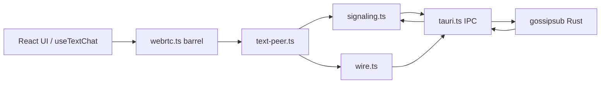
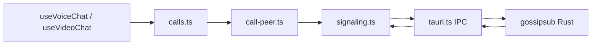

# Transport layer

WebRTC peer connections, encrypted signaling, and chat wire format for the Vibe client.

**Import from `@/lib/webrtc`** (barrel) in app code — not from individual files in this folder.

For platform-level architecture, see [ARCHITECTURE.md](../../../ARCHITECTURE.md). For wire format rules, see [SPEC.md](../../../SPEC.md) §9.

## Modules

| File | Role |
|------|------|
| `types.ts` | Signaling message types, envelope shapes, call/text discriminated unions |
| `signaling.ts` | Gossipsub listener, encrypt/decrypt via Tauri, route dispatch |
| `wire.ts` | Data channel bytes, gossipsub send, message ingest |
| `rtc-utils.ts` | ICE servers, SDP helpers, polite/impolite role |
| `ice-buffer.ts` | Queued ICE candidates (inbound, outbound, orphan call ICE) |
| `text-peer.ts` | Text `RTCPeerConnection` registry + negotiation + data channel |
| `call-peer.ts` | Call `RTCPeerConnection` registry + track merge |
| `register.ts` | Bootstraps default signaling routes at import (side effect) |

## Rules

- `signaling.ts` and `wire.ts` never import `RTCPeerConnection` — they only move encrypted bytes.
- **Dual PC model:** one text PC + one call PC per remote peer. Call renegotiation must not block chat.
- **Polite / impolite negotiation:** the peer with the lexicographically **higher** Peer ID is the offerer; the lower peer answers. This avoids offer glare when both sides connect at once.
- `registerSignalingRoutes` **merges** partial route maps — callers add handlers without wiping existing routes.

## Data flow (text)

1. UI calls `ensureTextTransport` / `sendTextMessage` via the barrel.
2. `text-peer.ts` builds SDP/ICE and passes JSON through `signaling.ts`.
3. Rust encrypts and publishes on `vibe/signal/{conversation_id}`.
4. Remote Rust decrypts → emits `signaling` event → TS applies remote description/ICE.
5. When the data channel opens, `wire.ts` sends raw encrypted bytes on the DC; otherwise gossipsub relay.

## Data flow (calls)

1. `calls.ts` owns call state (invite, accept, decline, end) and media streams.
2. `call-peer.ts` manages a dedicated call PC per peer (separate from text).
3. Call signaling uses the same encrypted gossipsub path with `call-*` message types.
4. UI subscribes via `subscribeCallState` / `getCallSnapshot` (external store, not React).

## Public API

Re-exported from `@/lib/webrtc`:

| Export | Purpose |
|--------|---------|
| `ensureTextTransport`, `closeTextTransport`, `resetTextTransport` | Text PC lifecycle |
| `sendTextMessage`, `isTextChannelOpen`, `subscribeTextChannelState` | Hybrid DC / gossipsub send |
| `ensureCallPeerConnection`, `closeCallPeerConnection`, … | Call PC lifecycle (used by `calls.ts`) |
| `registerSignalingRoutes`, `publishSignalingMessage`, … | Signaling hooks |
| `ICE_SERVERS`, `TEXT_CHANNEL_LABEL`, … | Shared RTC constants |

Call session API lives in `@/lib/calls.ts` (`startCall`, `acceptCall`, `subscribeCallState`, …).

React bindings: `useTextChat`, `useVoiceChat`, `useVideoChat` in `src/hooks/`.
